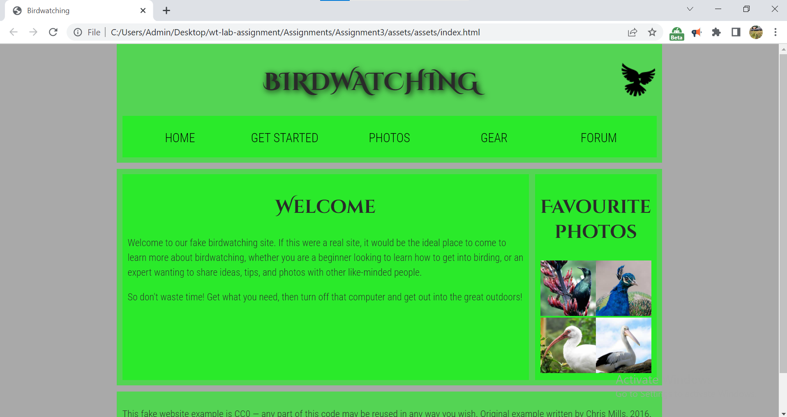

# Assignment 3 - Fixing the Starting template from mdn website

## About MDN
MDN Web Docs, previously Mozilla Developer Network and formerly Mozilla Developer Center, is a documentation repository and learning resource for web developers. It was started by Mozilla in 2005[2] as a unified place for documentation about open web standards, Mozilla's own projects, and developer guides.[3]

MDN Web Docs content is maintained by Mozilla, Google employees, and volunteers (community of developers and technical writers). It also contains content contributed by Microsoft, Google, and Samsung who, in 2017, announced they would shut down their own documentation projects and move all their documentation to MDN Web Docs.[4] Topics include HTML5, JavaScript, CSS, Web APIs, Django, Node.js, WebExtensions, MathML, and others.[5]
## Screenshots

