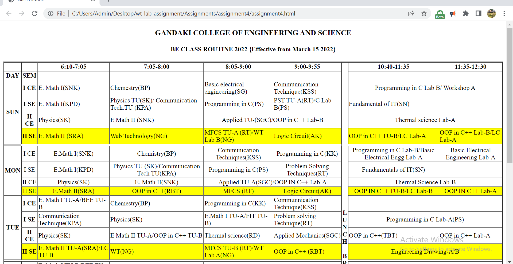

# Assignment 4 -make table (college - routine )
#### About tables in HTML
Overview
```
In Hypertext Markup language (HTML), tables allow web authors to arrange data such as text, images and links to other content into rows and columns. Tables present data in such a way that the viewer can look up values which indicate connections between the different types of data, for example, the bus fare chart for trips between a number of cities in the USA.
HTML Table basics

In HTML, a table is created by using the <table> element, with the <tr> and <td> elements. The <table> creates the shell of a table, while the <tr> and <td> elements create the rows and columns, respectively. The <th> element is used to create headers. A set of <table> and </table> opening and closing tags respectively are required to create the table shell.
```
HTML tables may not always be advisable
Despite being useful for presenting tabular data in web pages, more current versions of HTML i.e. HTML 4.01 and HTML 5 do not recommend tables for layouts because:

When used as layout documents, tables may not render correctly to non-visual media i.e. screen readers, making it difficult for visually impaired users to navigate pages.
the table code could become harder to maintain since table layouts involve more complex HTML structures.
tables, especially nested (one or more tables placed in another table) ones could take longer to load on a web page.
table created layout can hurt search engine optimization (SEO). Since search engines place a higher rating on content at the top of a web page i.e. navigation, thus placing a much lower rating on the table data.
tables are not automatically responsive since they are sized according to their content. Viewing HTML table layouts on mobile devises will look like Figure 4 (below) and will require back-and-forth side swiping and device flipping to view it.


## Screenshots



