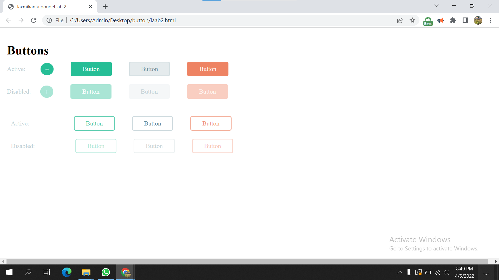
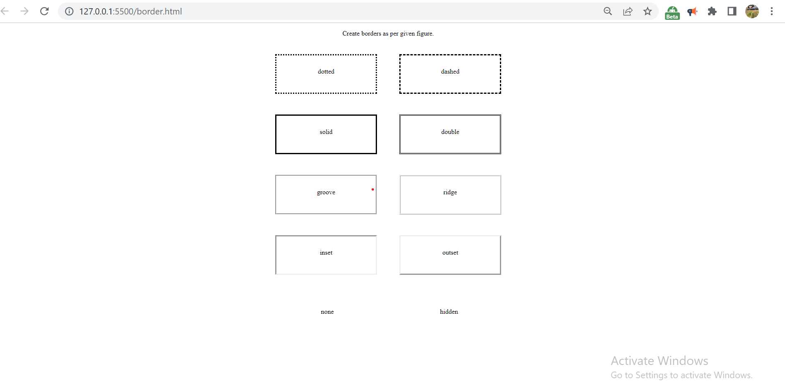

# Lab-2 

### Questions:
 Buttons, Border, Color and Pseudo class.

 Create buttons as per given figure.

 Create borders as per given figure

## Acknowledgements
    buttons in html : Definition and Usage. The <button> tag defines a clickable button. Inside a <button> element you can put text (and tags like <i> , <b> , <strong> ,   ,  , etc.). That is not possible with a button created with the <input> element!
    CSS Border Style

The border-style property specifies what kind of border to display.

The following values are allowed:

dotted - Defines a dotted border

dashed - Defines a dashed border

solid - Defines a solid border

double - Defines a double border

groove - Defines a 3D grooved border. The effect depends on the border-color value

ridge - Defines a 3D ridged border. The effect depends on the border-color value

inset - Defines a 3D inset border. The effect depends on the border-color value

outset - Defines a 3D outset border. The effect depends on the border-color value

none - Defines no border

hidden - Defines a hidden border

The border-style property can have from one to four values (for the top border, right border, bottom border, and the left border).
 
 
 ### colors in html
 HTML colors are specified with predefined 
 
 color names

   with RGB

    HEX

     HSL

     RGBA
     
    HSLA

## Screenshots of buttons and border
#### buttons

#### borders

## SOME COMMENTS FOR FURTHER USE

The <button> tag defines a clickable button. Inside a <button> element you can put text (and tags like <i> , <b> , <strong> ,   ,  , etc.). That is not possible with a button created with the <input> element!
The border-style property specifies what kind of border to display.

The following values are allowed:

dotted - Defines a dotted border
dashed - Defines a dashed border
solid - Defines a solid border
double - Defines a double border
groove - Defines a 3D grooved border. The effect depends on the border-color value
ridge - Defines a 3D ridged border. The effect depends on the border-color value
inset - Defines a 3D inset border. The effect depends on the border-color value
outset - Defines a 3D outset border. The effect depends on the border-color value
none - Defines no border
hidden - Defines a hidden border

 pseudo-class is used to define a special state of an element.

For example, it can be used to:

Style an element when a user mouses over it
Style visited and unvisited links differently
Style an element when it gets focus