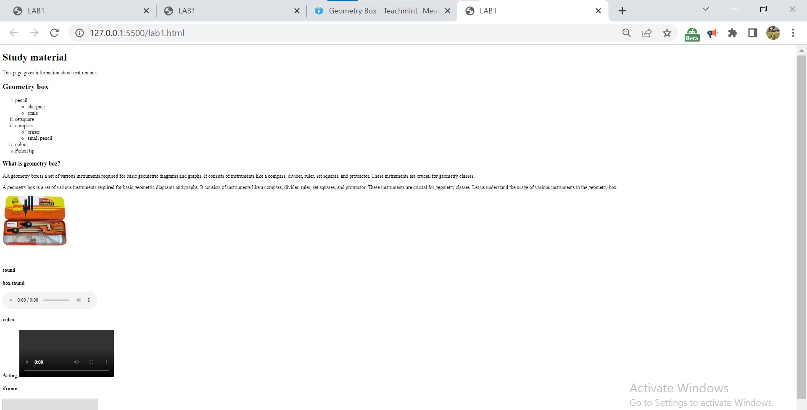

# Lab-1 HTML Elements.
Questions:

Make a webpage with the following html elements:
1) Nested order and unorder list

2) semantics tags for the layout
3) text formatting tags

4) image, video and audio
5) iframe

## Documentation

ordered and unordered list

HTML lists are used to present list of information in well formed and semantic way.
 There are two different types of list in HTML and each one has a specific purpose and meaning.

Unordered list — Used to create a list of related items, in no particular order.

Ordered list — Used to create a list of related items, in a specific order.

semantic tags:

Semantic HTML is the use of HTML markup to reinforce the semantics, or meaning, of the information in web pages and web applications rather than merely to define its presentation or look. Semantic HTML is processed by traditional web browsers as well as by many other user agents.

text formating tags in HTML:

HTML Formatting Elements

Formatting elements were designed to display special types of text:

<b> - Bold text

<strong> - Important text

<i> - Italic text

<em> - Emphasized text

<mark> - Marked text

<small> - Smaller text

<del> - Deleted text

<ins> - Inserted text

 - Subscript text

 - Superscript text

## Screenshots

