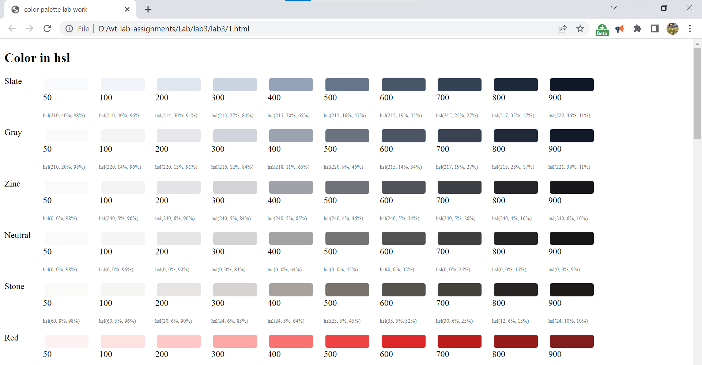

# LAB 3 - HTML colors

In this lab, we did about html colors and various ways to represent them in a web page.

## Acknowledgements

text and theory here are  inspired from w3schools website.

## Theory:

HTML colors are specified with predefined color names, or with RGB, HEX, HSL, RGBA, or HSLA values.

#### color name:
In HTML, a color can be specified by using a color name:

Tomato, 
Orange, 
DodgerBlue, 
MediumSeaGreen, 
Gray, 
SlateBlue, 
Violet, 
LightGray, 

HTML supports 140 standard color names.

#### In HTML, colors can also be specified using RGB values, HEX values, HSL values, RGBA values, and HSLA values.

## HSL
In HTML, a color can be specified using hue, saturation, and lightness (HSL) in the form:

hsl(hue, saturation, lightness)

Hue is a degree on the color wheel from 0 to 360. 0 is red, 120 is green, and 240 is blue.

Saturation is a percentage value, 0% means a shade of gray, and 100% is the full color.

Lightness is also a percentage value, 0% is black, and 100% is white.

## RGB 
RGB Color Values
In HTML, a color can be specified as an RGB value, using this formula:

rgb(red, green, blue)

Each parameter (red, green, and blue) defines the intensity of the color with a value between 0 and 255.

This means that there are 256 x 256 x 256 = 16777216 possible colors!

For example, rgb(255, 0, 0) is displayed as red, because red is set to its highest value (255), and the other two (green and blue) are set to 0.

Another example, rgb(0, 255, 0) is displayed as green, because green is set to its highest value (255), and the other two (red and blue) are set to 0.

To display black, set all color parameters to 0, like this: rgb(0, 0, 0).

To display white, set all color parameters to 255, like this: rgb(255, 255, 255).

## HEX Color Values
In HTML, a color can be specified using a hexadecimal value in the form:

#rrggbb

Where rr (red), gg (green) and bb (blue) are hexadecimal values between 00 and ff (same as decimal 0-255).

For example, #ff0000 is displayed as red, because red is set to its highest value (ff), and the other two (green and blue) are set to 00.

Another example, #00ff00 is displayed as green, because green is set to its highest value (ff), and the other two (red and blue) are set to 00.

To display black, set all color parameters to 00, like this: #000000.

To display white, set all color parameters to ff, like this: #ffffff.

## Screenshots

